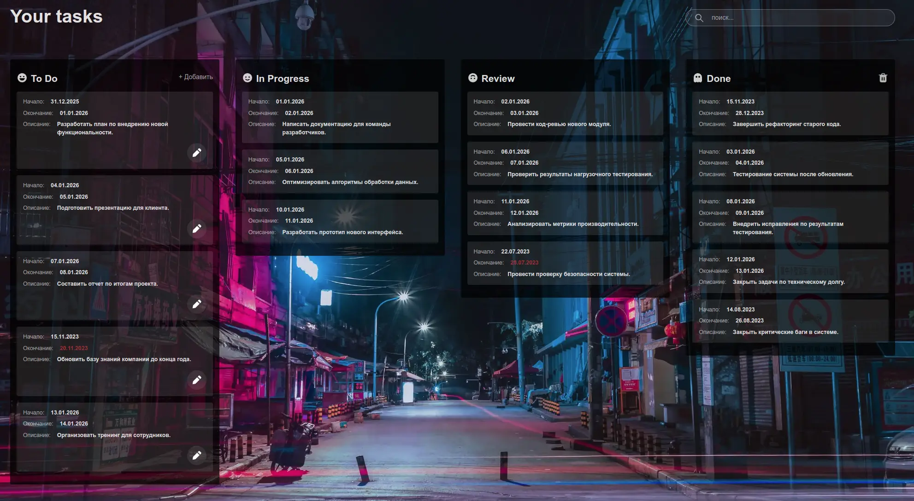
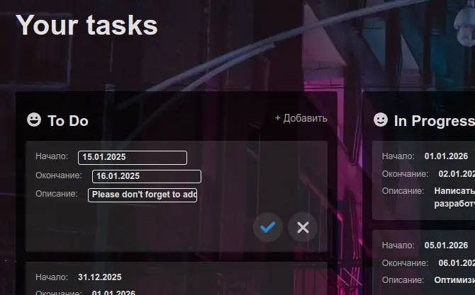
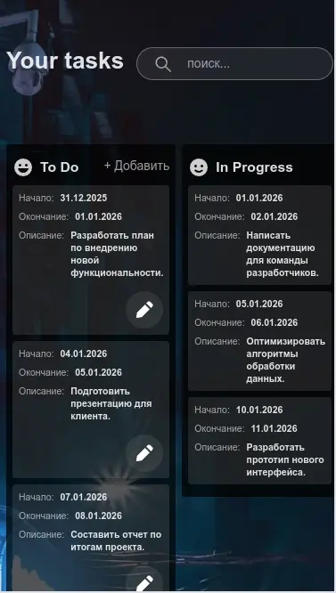

# My Trello.

> Web for my-trello service (https://github.com/RimidalU/my-trello) (**in the future**).

[](https://rimidalu.github.io/my-trello-web/)


---

[Description](#description) •
[Project setup](#project-setup) •
[Features](#features) •
[How To Use](#how-to-use) •
[Project Status](#project-status) •
[Room for Improvement](#room-for-improvement) •
[License](#license) •
[Contact](#contact)

  

## Description

Single page Trello clone application in React.js.

Stack: React, TypeScript, TailwindCSS.

## Project setup

- Clone this repo to your desktop and run `npm install` to install all the dependencies.
- Once the dependencies are installed, you can run `npm dev` to start the application.
- Enjoy.

### Project structure

```shell
.
├── .github                         # GitHub folder
├── .husky                          # Husky configuration
├── .vscode                         # VSCode configuration
├── public                          # Public assets folder
├── src
│   ├── App.txt                     # Main page of App
│   ├── assets                      # Assets app
│   ├── components                  # React components
│   ├── data                        https://github.com/RimidalU/my-trello# Data folder
│   ├── contexts                    # React contexts
│   ├── models                      # Models folder
│   ├── repositories                # Repositories folder
│   ├── utils                       # Utilities folder
├── tailwind.config.js              # Tailwind CSS configuration
└── tsconfig.json                   # TypeScript configuration
```

## Features

- React only (no frameworks)
- `husky` and hooks (lint in _pre-commit_, check commit message);
- React Context;
- React Reducer;

## How To Use

Run [Live Demo](https://github.com/RimidalU/my-trello)

![tutorial][tutorial]

## Project Status

Project is: _in progress_

## Room for Improvement

To do:

- [ ] Add tests
- [ ] change task type

Improvement:

- [ ] change project layout
- [ ] ...

## License

This project is open source and available under the [BSD 3-Clause](../LICENSE.md).

## Contact

Created by [@RimidalU](https://www.linkedin.com/in/uladzimir-stankevich/) - feel free to contact me!

<p align="right"><a href="#start"></a></p>

<!-- MARKDOWN LINKS & IMAGES -->

[tutorial]: ./assets/demo.webp
